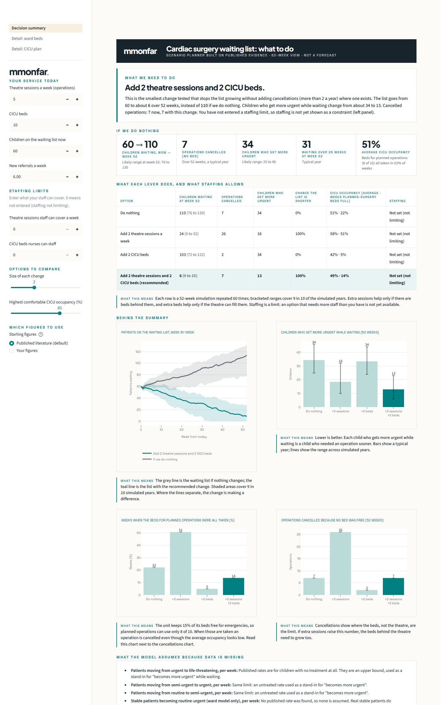

# Cardiac Waiting List Planner

What happens to the cardiac waiting list if we add theatre time, beds or staff? A scenario planner built on published evidence, with the option to use your own figures.

**Status: prototype · not a medical device · shows a range of possible years, not a forecast.**



---

## What you see

Open the app and the first screen answers four questions without any set-up:

1. **What do we need to do?** The smallest change tested that stops the waiting list growing without adding cancelled operations, in one sentence. If every such change adds cancellations, it names the trade-off.
2. **What if we do nothing?** The waiting list, operations cancelled for lack of a bed, and children who get more urgent while waiting, over the next 52 weeks.
3. **What does each lever do?** Extra theatre sessions, extra CICU beds, or both, side by side, with the effect of each.
4. **What does staffing allow?** Enter how many theatre sessions and CICU beds your staff can cover. Any option that needs more is marked as needing more staff.

Below that, a panel lists what the model assumes because data is missing, and every default has its source.

Two detail pages go deeper: **Detail: ward beds** (a waiting list feeding a surgical ward) and **Detail: CICU plan** (a plan for operations a week and an optional extra bed, checked against how often it holds across many simulated years).

## Published evidence first, your figures if you wish

The planner starts on **figures from the published literature**, each with a DOI (table below). Switch to **Your figures** in the left panel to enter your own weekly chances that a waiting child becomes more urgent; they are labelled as yours and are never the default. The size of your service (waiting list, referrals, sessions, beds) is not a literature figure: the defaults describe an illustrative unit, so enter yours.

## How to run

Python 3.11 or newer.

```bash
git clone https://github.com/mmonfar/cardiac_model.git
cd cardiac_model
python -m venv .venv
.venv/bin/pip install -e ".[dev]"        # Windows: .venv\Scripts\pip install -e ".[dev]"
.venv/bin/streamlit run src/cardiac_capacity_planner/app.py
.venv/bin/pytest                          # optional: the test suite
```

Everything installs from PyPI (numpy, pandas, plotly, streamlit). The theme and its two fonts are bundled, so the app needs no other folder or external service.

## How it works, in brief

- Each week: patients on the list age, some get more urgent (one random draw per patient), new referrals arrive, and operations are scheduled most urgent first, then longest wait, if a bed is free. Each stay holds a bed for a random length.
- This is repeated for many simulated years with different random draws, so the page shows a typical year and a range rather than one forecast. Every result is reproducible from its seed.
- The first screen compares "do nothing" with adding theatre sessions, adding CICU beds, or both. Staffing is a limit you enter, not a lever with its own model.
- The detail pages recommend a set-up by testing many options, keeping those that work in at least a chosen share of simulated years (default 90%), and re-testing the winner on fresh years. The share is reported with a confidence interval.
- Life-threatening cases are always operated first and never wait for a bed; the CICU plan keeps average occupancy at or below a target you set (default 85%).

## Where the default figures come from

Every default, its source, and what the model assumes where no source exists. The same table is in the app under "Where the numbers come from". **proxy** means a published figure used for a neighbouring quantity; **assumption** means no published figure exists, so enter your own.

| Parameter | Default | Basis | Source | What the model assumes because data is missing |
|---|---|---|---|---|
| Patients moving from urgent to life-threatening, per week | 2.34% | proxy | Saxena et al. 2019, doi:10.4103/apc.apc_32_19 (complete AVSD, untreated, weeks 0-26) | Published rates are for children with no treatment at all. They are an upper bound, used as a stand-in for "becomes more urgent" while waiting. |
| Patients moving from semi-urgent to urgent, per week | 1.23% | proxy | Saxena et al. 2019, doi:10.4103/apc.apc_32_19 (large VSD: death 0.20% + loss of operability 1.03%) | Same limit: an untreated rate used as a stand-in for "becomes more urgent". |
| Patients moving from routine to semi-urgent, per week | 0.80% | proxy | Saxena et al. 2019, doi:10.4103/apc.apc_32_19; Martins et al. 2018, doi:10.21470/1678-9741-2018-0019 (tetralogy of Fallot, untreated, weeks 0-52) | Same limit: an untreated rate used as a stand-in for "becomes more urgent". |
| Stable patients becoming routine-urgent (ward model only), per week | 0% | assumption | none published | No published rate was found, so none is assumed. Real stable patients do sometimes worsen. |
| Extra risk after a long wait (26+ weeks) | none (x1.0) | assumption | Faateh et al. 2025, doi:10.1016/j.xjon.2024.10.015 reports 1.49, but for complications after one repair, not for waiting | No published source gives a general long-wait factor, so none is applied. Waiting probably does add risk. |
| Which lesion counts as which urgency category | proposal | proxy | Dorobantu et al. 2023, doi:10.1016/j.jacadv.2023.100407; Gobergs et al. 2016, doi:10.6001/actamedica.v23i2.3325; Iskander et al. 2024, doi:10.3390/jcm13144244; Ji et al. 2021, doi:10.3389/fcvm.2021.775578 | A proposal built from published operating windows. It needs a cardiologist's check. |
| CICU stay: transposition 7 days, HLHS first operation 19.6 days (case mix only) | as stated | literature | Dorobantu et al. 2023, doi:10.1016/j.jacadv.2023.100407; Iskander et al. 2024, doi:10.3390/jcm13144244 | - |
| Infants lost between first and second HLHS operation (case mix only) | 8% | literature | Staehler et al. 2023, doi:10.3389/fcvm.2023.1239477 | - |
| CICU stay by urgency group (14 / 10 / 5 / 3 days) | 14 / 10 / 5 / 3 | assumption | none published for these groups | Typical stays differ by hospital and case mix. Replace with your own average stays. |
| Share of referrals in each urgency group | 8% / 15% / 30% / 47% | assumption | none published (population shares are not available) | Illustrative. Your referral mix will differ. |
| Waiting list, referrals a week, theatre sessions, CICU beds | 60, 5, 5, 10 | assumption | an illustrative unit, not a literature figure | These describe a service, not a disease. Enter your own. |
| Safe CICU occupancy target | 85% | assumption | no published level was found | Many units quote a figure around this level, but it is your call. |
| Staff who can cover theatre sessions and CICU beds | not set | assumption | no published figure; it depends on your rosters | Staffing is not limiting until you enter a cap. Enter yours to see which options are out of reach. |

The published weekly rates are untreated hazards (death or loss of operability with no treatment at all), derived from survival figures in the cited papers. They are upper bounds, used as stand-ins for "becomes more urgent while waiting". The derivation is in [`docs/risk-table.md`](docs/risk-table.md) and [`docs/hazard-calibration-output.md`](docs/hazard-calibration-output.md) (script: `analysis/hazard_calibration.py`). A comparison with published ranges is in [`docs/sanity-check.md`](docs/sanity-check.md): stays are plausible; occupancy and waiting times could not be judged for lack of a comparable published figure.

## Limitations

- Prototype. It has not been validated against real data and gives no forecast. The published rates are proxies awaiting a clinician's check.
- No deaths are modelled while waiting, only moves up an urgency category.
- Staffing is a limit you enter, not a modelled lever: the planner does not know how many staff a session or a bed needs.
- The managed-patient escalation rate, CICU occupancy and waiting-time ranges for a comparable unit, and a safe occupancy target are awaiting a published source.
- Not modelled: a catheter-lab queue and bridge procedures, weight- and age-dependent stays, an age clock for each patient.
- When demand exceeds what the occupancy ceiling can serve, the honest answer is more beds, fewer referrals or a lower target; the planner says "no plan found" rather than inventing one.
- The recommended weekly cases sit on a plateau: read the number as "at least this many", and the floor (the least that stops the list growing) as the minimum.
- Cost per surge bed is shown, but no cost threshold is built in.

## Project layout

```
src/cardiac_capacity/          engines: ward (v1, v2), CICU (v1, v2, stochastic plan), recommenders, parameter sets, case mix
src/cardiac_capacity_planner/  Streamlit app (pages: Decision summary, Detail: ward beds, Detail: CICU plan) and the bundled theme and fonts
tests/                         engine and app tests (synthetic data only)
analysis/                      scripts that regenerate the figures in docs/
docs/                          parameter tables, sanity check, screenshots, earlier results
```

## Licence

Code is licensed under **AGPL-3.0-or-later** (see [`LICENSE`](LICENSE)); a commercial licence is available on request from the author via [LinkedIn](https://www.linkedin.com/in/martin-monteagudo-farina/). Non-code content is under [CC BY-NC 4.0](https://creativecommons.org/licenses/by-nc/4.0/). Details in [`LICENSING.md`](LICENSING.md). The two bundled fonts keep their own SIL Open Font License 1.1 (`src/cardiac_capacity_planner/brand/fonts/OFL.txt`).

## Disclaimer

Research and demonstration software. Not a medical device and not intended for clinical decision-making, diagnosis or treatment. Provided "as is", without warranty of any kind; the author accepts no liability for any use. Uses synthetic data only.

Built with AI assistance (Claude); all code and claims reviewed by the author. See [`LICENSE`](LICENSE) for the full warranty terms.

## Independence and data notice

**Independence and data notice.** This is a personal project, developed independently in my own time and on my own equipment. It is not affiliated with, endorsed by, or representative of my employer or any other organisation. It contains no employer data, systems, code or confidential information. All data in this repository is synthetic or fictitious, and any resemblance to real patients, staff or events is coincidental. Views are my own.
